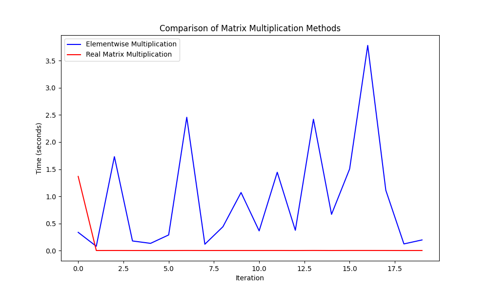
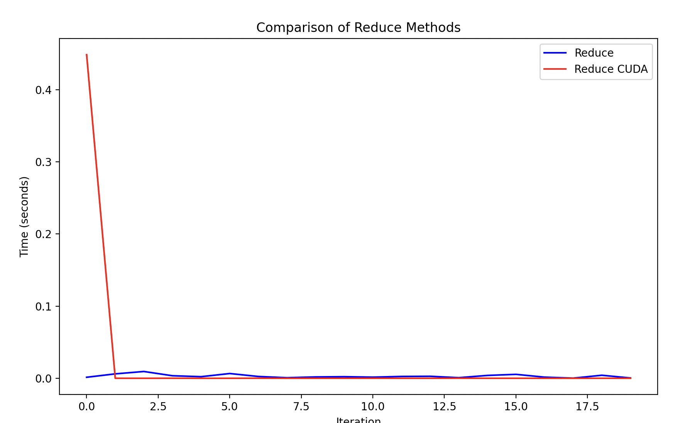

# MiniTorch Module 3


* Docs: https://minitorch.github.io/

* Overview: https://minitorch.github.io/module3.html


You will need to modify `tensor_functions.py` slightly in this assignment.

* Tests:

```
python run_tests.py
```

* Note:

Several of the tests for this assignment will only run if you are on a GPU machine and will not
run on github's test infrastructure. Please follow the instructions to setup up a colab machine
to run these tests.


Here is a brief sanity check that the elementwise multiplication is slower than the real matrix multiplication. See the file test_manual.py for more details.





For numba:
Average time for elementwise multiplication: 1.065640 seconds
Average time for real matrix multiplication: 0.072189 seconds
Average time for reduce: 0.003198 seconds
Average time for reduce numba: 0.022610 seconds (note this is because I only did it 20 times, but as you can see it is faster than the regular version after the first iteration)

For cuda:
Average time for elementwise multiplication: 1.457392 seconds
Average time for cuda matrix multiplication: 0.049690 seconds
Average time for reduce: 0.004651 seconds
Average time for reduce cuda: 0.015866 seconds


SPLIT DATASET


Epoch  0  loss  7.506276978187855 correct 32
Epoch  10  loss  5.1262630893371055 correct 40
Epoch  20  loss  5.722724201189267 correct 45
Epoch  30  loss  4.224430597723488 correct 46
Epoch  40  loss  2.9459282207563753 correct 47
Epoch  50  loss  1.6782743007299523 correct 46
Epoch  60  loss  4.116299031888678 correct 47
Epoch  70  loss  1.494442988683634 correct 48
Epoch  80  loss  2.8724289169342008 correct 49
Epoch  90  loss  2.55250503072933 correct 48
Epoch  100  loss  1.370647565444746 correct 48
Epoch  110  loss  1.6354420852194813 correct 48
Epoch  120  loss  1.5267183738108563 correct 49
Epoch  130  loss  1.6396870312921892 correct 48
Epoch  140  loss  0.532700523578322 correct 48
Epoch  150  loss  1.0569582570440017 correct 48
Epoch  160  loss  2.0745840853120483 correct 48
Epoch  170  loss  0.1773121810259196 correct 48
Epoch  180  loss  0.5467053640396895 correct 50
Epoch  190  loss  1.1236198774640305 correct 49
Epoch  200  loss  0.5401287692409455 correct 48
Epoch  210  loss  0.9058465277153505 correct 48
Epoch  220  loss  0.528335408575202 correct 49
Epoch  230  loss  0.2897824522432052 correct 48
Epoch  240  loss  1.6647561139697513 correct 50
Epoch  250  loss  1.5830351224869024 correct 50
Epoch  260  loss  0.705208032787609 correct 48
Epoch  270  loss  0.7427509779324821 correct 49
Epoch  280  loss  0.8364580567866163 correct 50
Epoch  290  loss  0.20172985461125012 correct 50
Epoch  300  loss  1.0072478025391052 correct 50
Epoch  310  loss  1.2270484595769577 correct 50
Epoch  320  loss  1.2145931080509262 correct 50
Epoch  330  loss  0.45658549376601026 correct 50
Epoch  340  loss  0.7660193149306838 correct 49
Epoch  350  loss  1.620436216219945 correct 50
Epoch  360  loss  0.8945796215192531 correct 48
Epoch  370  loss  1.213293162973407 correct 50
Epoch  380  loss  2.6347920712250072 correct 45
Epoch  390  loss  0.20192237956160444 correct 50
Epoch  400  loss  1.1328610766944802 correct 50
Epoch  410  loss  1.6407653060013327 correct 50
Epoch  420  loss  0.820309154485144 correct 50
Epoch  430  loss  0.1744059822589843 correct 48
Epoch  440  loss  0.5109811678521681 correct 50
Epoch  450  loss  0.8526636583154583 correct 49
Epoch  460  loss  0.13240624332117096 correct 48
Epoch  470  loss  1.0948191946019654 correct 50
Epoch  480  loss  0.13169688338319843 correct 50
Epoch  490  loss  0.11341494842648718 correct 50